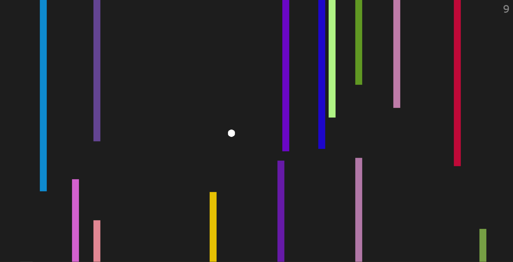

# Evasion Game

*Created in 2017* 
One of my very first javascript games created. 
It is written in pure `javascript` and `html`.

# How to run
You can run this game by opening the [index.html](./index.html) in your browser or you can run a simple http server in the root folder of this repo e.g. (in python) `python -m http.server`

# Controls
`arrow keys` to move up/down/left/right. If you cross the left or right game border it will spawn you on the other side. 
`p` pause the game. 
`r` if it is Game Over you can press this to restart the game.
